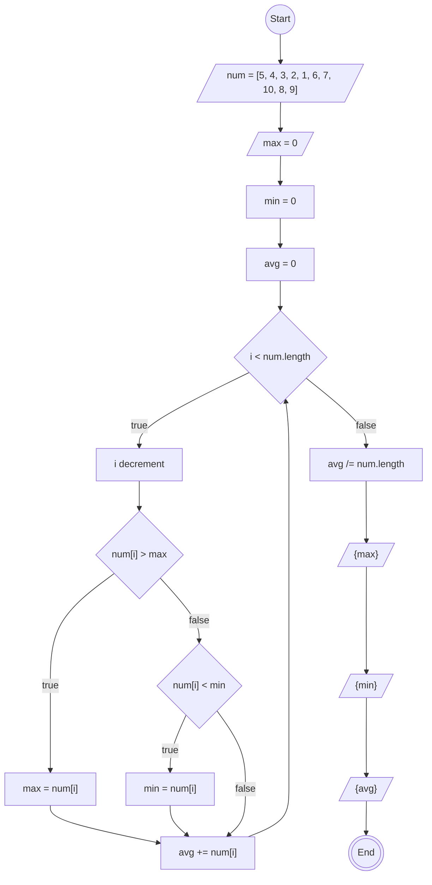

```mermaid
flowchart TD

mulai@{ shape: circle, label: "Start"}
isiangka@{ shape: lean-r, label: "num = [5, 4, 3, 2, 1, 6, 7, 10, 8, 9]"}

terbesar@{ shape: lean-r, label: "max = 0"}
terkecil@{ shape: rect, label: "min = 0"}
taRata@{ shape: rect, label: "avg = 0"}

lop@{ shape: diamond, label: "i < num.length"}
tambah@{ shape: rect, label: "i decrement"}

ifMx@{ shape: diamond, label: "num[i] > max"}
ifMn@{ shape: diamond, label: "num[i] < min"}


on@{ shape: rect, label: "max = num[i]"}
in@{ shape: rect, label: "min = num[i]"}
tmbhSm@{ shape: rect, label: "avg += num[i]"}

ClgAvg@{ shape: rect, label: "avg /= num.length"}

hsMx@{ shape: lean-r, label: "{max}"}
hsMn@{ shape: lean-r, label: "{min}"}
hsAvg@{ shape: lean-r,  label: "{avg}"}

selesai@{ shape: doublecircle, label: "End"}

mulai-->isiangka-->terbesar-->terkecil-->taRata-->
lop--true-->tambah-->
    ifMx--true-->on-->tmbhSm
    ifMx--false-->
    ifMn--true-->in-->tmbhSm-->lop
    ifMn--false-->tmbhSm


lop--false-->ClgAvg-->hsMx-->hsMn-->hsAvg-->selesai

```
